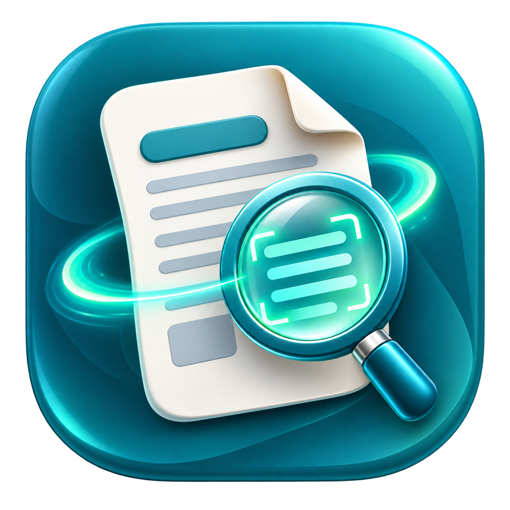

<p align="center">
  
</p>

<h1 align="center">ورقتي — War2aty</h1>

<p align="center">
  <strong>«ورقتي بتقول إيه؟»</strong><br/>
  صوّر أي ورقة مطبوعة، والتطبيق يقرأها ويشرحلك بالعربي البسيط.
</p>

<p align="center">
  
  
  
  
  
</p>

---

## About

A mobile app that reads printed documents using OCR and explains them in simple **Egyptian Arabic** — built for users who struggle with formal paperwork, including the elderly and those with limited reading ability.

The user photographs a printed document, the app extracts its text (locally when offline, or via secure online processing when available), then classifies and explains it: document type, key information, required actions, and upcoming deadlines worth remembering.

---

## ✨ Features

| | Feature | Description |
|---|---------|-------------|
| 📸 | **Smart Capture** | Live camera with real-time document edge detection, perspective correction, and auto-crop |
| 🔍 | **Dual OCR Pipeline** | Online processing (Azure AI Document Intelligence) with on-device fallback (Tesseract) for offline use |
| 🤖 | **AI Document Analysis** | Classifies document type, extracts key data (amounts, dates, names), and explains required actions — all in simple Egyptian Arabic |
| 🔊 | **Audio Reader** | Text-to-speech reads raw OCR text aloud or narrates the full analysis screen |
| 💾 | **Saved Papers** | Browse, search, and filter previously analyzed documents — stored locally with encrypted images |
| ⏰ | **Smart Reminders** | Set local notifications for deadlines and due dates found in documents |
| 🔒 | **Privacy-First** | Images never stored on any server — processed in-memory, deleted immediately. User controls all data sharing |
| ♿ | **Accessible** | RTL-first design, large touch targets, high-contrast support, screen reader semantics, reduced-motion respect |

---

## 🏗️ Architecture

**Feature-based Clean Architecture** with strict three-layer separation per feature:

```
presentation  →  domain  →  data
   (UI)        (business)   (APIs, DB, storage)
```

### Project Layout

```
lib/
├── app/                    # App shell, routing (go_router), dependency injection (get_it)
├── core/                   # 27 shared modules
│   ├── accessibility/      #   Screen reader & motion helpers
│   ├── analysis/           #   Analysis models & contracts
│   ├── audio/              #   TTS abstractions
│   ├── config/             #   Runtime feature flags
│   ├── connectivity/       #   Network status
│   ├── crypto/             #   AES-256-GCM image encryption
│   ├── database/           #   Drift schema, DAOs, migrations
│   ├── documents/          #   Shared document entities
│   ├── env/                #   Environment & flavor config
│   ├── error/              #   AppFailure sealed hierarchy + Result<T,F>
│   ├── localization/       #   Arabic strings (manual, no code-gen)
│   ├── logging/            #   Privacy-safe logger (no PII)
│   ├── money/              #   Currency parsing & formatting
│   ├── navigation/         #   Route constants & helpers
│   ├── network/            #   Dio client, interceptors
│   ├── permissions/        #   Camera / notification permission flows
│   ├── reminders/          #   Notification scheduling
│   ├── storage/            #   Encrypted file I/O
│   ├── theme/              #   Colors, typography (Cairo font), spacing
│   ├── time/               #   Africa/Cairo timezone, date formatting
│   ├── usage/              #   Daily analysis quota tracking
│   ├── widgets/            #   Reusable UI components
│   └── …                   #   identity, icons, settings, utils, result
│
└── features/               # 10 feature modules
    ├── analysis/           #   AI classification & explanation (45 files)
    ├── audio_reader/       #   TTS playback (13 files)
    ├── bootstrap/          #   Animated splash & initialization (14 files)
    ├── capture/            #   Camera, edge detection, crop (68 files)
    ├── home/               #   Main screen (8 files)
    ├── ocr/                #   OCR processing pipelines (28 files)
    ├── onboarding/         #   First-launch consent flow (9 files)
    ├── reminders/          #   Deadline reminders (23 files)
    ├── saved_papers/       #   Document history & details (18 files)
    └── settings/           #   Privacy, permissions, about (4 files)
```

Each feature follows the same internal structure:
```
feature/
├── data/            # Data sources, DTOs (manual fromJson/toJson), mappers, repo impls
├── domain/          # Entities, repository interfaces, use cases
└── presentation/    # Cubit states (sealed classes), screens, widgets
```

---

## 🛠️ Tech Stack

| Category | Technology |
|----------|-----------|
| **Framework** | Flutter 3.11 · Dart 3.11 (Android + iOS, portrait-only) |
| **State Management** | Cubit / Bloc (`flutter_bloc`) |
| **Dependency Injection** | `get_it` — modular registration |
| **Routing** | `go_router` with shell routes |
| **Local Database** | Drift + SQLite (code-generated schema) |
| **Backend** | Supabase Edge Functions (TypeScript / Deno) |
| **Authentication** | Supabase Anonymous Auth (invisible to user) |
| **OCR — Online** | Azure AI Document Intelligence (behind Edge Function) |
| **OCR — Offline** | Tesseract (on-device, Arabic + English) |
| **AI Analysis** | Groq Structured Output (behind Edge Function — never sees images) |
| **Image Security** | AES-256-GCM encrypted local storage |
| **Secrets** | `flutter_secure_storage` (device keychain) |
| **Notifications** | `flutter_local_notifications` |
| **Text-to-Speech** | `flutter_tts` |
| **Camera** | `camera` + `doclens` (edge detection) |

---

## 🔐 Privacy & Security

Privacy is a **non-negotiable core principle**, not a feature toggle:

- **Images never leave the device permanently** — when online processing is used, the image is sent to a secure Edge Function, read in-memory, and deleted immediately. No server stores it.
- **The AI model never sees the image** — only extracted text is sent for classification.
- **Local image storage is encrypted** — AES-256-GCM, stored in the app's private directory. Temporary files are wiped after processing.
- **No analytics, no tracking, no Firebase** — zero telemetry.
- **User consent gate** — analysis requires explicit permission; without it, no data leaves the device.
- **No PII in logs** — OCR text, amounts, names, and dates are never logged.
- **All API keys server-side** — only the Supabase publishable anon key exists in the app.
- **EXIF / GPS metadata stripped** before any network transmission.

---

## 🧪 Testing

| Metric | Value |
|--------|-------|
| Test files | **210** |
| Source files | **443** Dart files |
| Source LOC | **~55,600** lines |
| Test LOC | **~34,900** lines |
| Test:Source ratio | **~0.63** |

Coverage spans: domain logic, data layer (DTOs, mappers, extractors), Cubit state transitions, widget rendering, and edge cases (empty/error/loading/partial states).

```bash
# Run all tests
flutter test

# Static analysis (strict — see analysis_options.yaml)
flutter analyze

# Format check
dart format --set-exit-if-changed .
```

---

## ⚙️ Backend — Edge Functions

Four Supabase Edge Functions (TypeScript / Deno) handle all server-side processing:

| Function | Purpose |
|----------|---------|
| `ocr-document` | Receives an image, extracts text via Azure AI Document Intelligence, returns text. Image deleted from memory immediately. |
| `analyze-document` | Receives OCR text, classifies via Groq structured output, returns analysis in Egyptian Arabic. |
| `get-usage` | Returns the user's daily analysis count (3/day free, `Africa/Cairo` timezone). |
| `health` | Liveness check for monitoring. |

See [`docs/API_CONTRACT.md`](docs/API_CONTRACT.md) for the full request/response schemas.

---

## 🚀 Getting Started

### Prerequisites

- **Flutter SDK** ≥ 3.11 (stable channel)
- **Android SDK** (API 21+) / **Xcode** (iOS 12+)
- **Supabase project** with edge functions deployed (`supabase/functions/`)

### Configuration

1. **Supabase config** — copy and fill in your project credentials:
   ```bash
   cp config/prod.json.example config/prod.json
   ```

2. **Android signing** (release builds only):
   ```bash
   cp android/key.properties.example android/key.properties
   # Edit with your keystore path and credentials
   ```

3. **Edge Function secrets** — set in your Supabase dashboard:
   - `AZURE_DI_ENDPOINT` / `AZURE_DI_KEY`
   - `GROQ_API_KEY`
   - See `supabase/.env.example` for the full list.

### Build & Run

```bash
# Development (connects to local/dev Supabase)
flutter run --flavor dev -t lib/main_dev.dart

# Production APK
flutter build apk --flavor prod --release \
  --dart-define-from-file=config/prod.json \
  -t lib/main_prod.dart

# Production App Bundle (Google Play)
flutter build appbundle --flavor prod --release \
  --dart-define-from-file=config/prod.json \
  -t lib/main_prod.dart
```

---

## 📚 Documentation

Comprehensive feature specs and implementation plans live in [`docs/features/`](docs/features/):

| Doc | Description |
|-----|-------------|
| [F00 — Foundation](docs/features/F00-foundation.md) | Project setup, architecture decisions |
| [F01 — Bootstrap & Identity](docs/features/F01-bootstrap-identity.md) | Splash screen, anonymous auth |
| [F02 — Onboarding & Home](docs/features/F02-onboarding-home.md) | First-launch flow, main screen |
| [F03 — Capture & Review](docs/features/F03-capture-review.md) | Camera, image review |
| [F04 — Local OCR](docs/features/F04-local-ocr.md) | Tesseract on-device processing |
| [F05 — Analysis Contract](docs/features/F05-analysis-contract.md) | AI analysis data model |
| [F06 — Backend (Groq)](docs/features/F06-backend-groq.md) | Edge Function integration |
| [F07 — Analysis Result](docs/features/F07-analysis-result.md) | Result screen UI |
| [F08 — Saved Papers](docs/features/F08-saved-papers.md) | Document history |
| [F09 — Reminders](docs/features/F09-reminders.md) | Notification scheduling |
| [F10 — Audio Reader](docs/features/F10-audio-reader.md) | Text-to-speech |
| [F11 — Settings & Privacy](docs/features/F11-settings-privacy.md) | User preferences, consent |
| [F13 — OCR Migration](docs/features/F13-ocr-provider-migration.md) | Azure AI online pipeline |
| [F15 — Document Crop](docs/features/F15-document-crop.md) | Perspective correction |
| [F16 — Live Edge Detection](docs/features/F16-live-edge-detection.md) | Real-time camera overlay |
| [API Contract](docs/API_CONTRACT.md) | Full Edge Function schemas |

---

## 📊 Project Stats

| | |
|---|---|
| **Dart source files** | 443 |
| **Lines of Dart code** | ~55,600 |
| **Test files** | 210 |
| **Lines of test code** | ~34,900 |
| **Edge Function code** | ~6,800 lines (TypeScript) |
| **Feature modules** | 10 |
| **Core modules** | 27 |
| **Total commits** | 195 |

---

## 📄 License

All rights reserved © 2026 Yusef Abdulkarim

---

<p align="center">Built with ❤️ in Cairo, Egypt</p>
